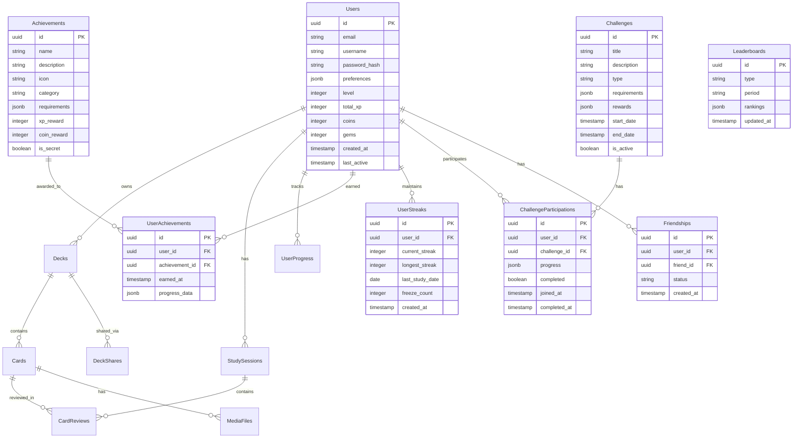

# StudyMaster PWA - Comprehensive Design Plan

## Overview

StudyMaster is a modern Progressive Web App that combines the best features from Anki, AnkiDroid, and Quizlet into a unified, gamified learning experience. The app focuses on spaced repetition, collaborative study, offline functionality, and engaging gamification elements.

## Core Features Analysis

### From Anki/AnkiDroid
- Advanced spaced repetition algorithm (SM-2/SM-18)
- Customizable card templates
- Detailed statistics and progress tracking
- Deck organization and hierarchies
- Advanced scheduling options

### From Quizlet
- Collaborative study sets
- Multiple study modes (flashcards, matching, multiple choice, true/false)
- Community sharing and discovery
- Clean, modern UI
- Social features

### Enhanced Gamification Features
- **Streak System**: Daily study streaks with streak freezes and recovery
- **Achievement System**: Unlock badges for milestones and special accomplishments
- **Leaderboards**: Global and friend-based rankings
- **XP & Levels**: Experience points for all study activities
- **Study Challenges**: Daily, weekly, and monthly challenges
- **Virtual Rewards**: Coins, gems, and cosmetic unlocks
- **Progress Visualization**: Interactive progress maps and skill trees
- **Social Competition**: Study duels and group challenges

## Technology Stack

### Frontend
- **React 18** with TypeScript
- **Vite** for build tooling
- **Tailwind CSS** for styling
- **Framer Motion** for animations
- **React Query** for state management and caching
- **Workbox** for PWA functionality
- **Chart.js** for gamification visualizations

### Backend
- **Node.js** with **Express.js**
- **PostgreSQL** for primary database
- **Redis** for caching, sessions, and leaderboards
- **Socket.io** for real-time collaboration and live challenges
- **AWS S3** for media storage
- **Bull Queue** for background job processing

### Mobile PWA Features
- Service Worker for offline functionality
- IndexedDB for local storage
- Web App Manifest
- Push notifications for streaks and challenges
- Camera API for image capture
- Vibration API for feedback

## Architecture Overview


## Enhanced Database Schema



## Gamification System Design

### XP & Leveling System
- **Study Session XP**: Base XP for completing study sessions
- **Accuracy Bonus**: Extra XP for high accuracy rates
- **Streak Multiplier**: XP multiplier based on current streak
- **Challenge Completion**: Bonus XP for completing challenges
- **Level Benefits**: Unlock new features, themes, and customizations

### Achievement Categories
1. **Study Milestones**: Cards reviewed, sessions completed, time studied
2. **Accuracy Achievements**: Perfect sessions, improvement streaks
3. **Streak Achievements**: Daily streaks, comeback achievements
4. **Social Achievements**: Friends added, decks shared, collaborations
5. **Challenge Achievements**: Challenge completions, leaderboard positions
6. **Special Achievements**: Holiday events, app anniversaries, hidden achievements

### Challenge Types
1. **Daily Challenges**: Quick 5-10 minute focused tasks
2. **Weekly Challenges**: Longer-term goals with bigger rewards
3. **Monthly Challenges**: Major milestones and competitions
4. **Community Challenges**: Global participation events
5. **Friend Challenges**: Direct competition with friends
6. **Deck-Specific Challenges**: Challenges tied to specific subjects

### Leaderboard System
- **Global Leaderboards**: All-time and monthly rankings
- **Friend Leaderboards**: Compare with friends
- **Subject Leaderboards**: Rankings by deck categories
- **Challenge Leaderboards**: Competition-specific rankings
- **Streak Leaderboards**: Longest current and all-time streaks

## Core Features Implementation

### 1. Spaced Repetition Algorithm
- SM-2 algorithm with gamification enhancements
- XP rewards based on difficulty and performance
- Streak bonuses for consistent reviews
- Achievement triggers for milestones

### 2. Card Types & Templates
- Basic (front/back)
- Cloze deletion
- Multiple choice
- Image occlusion
- Audio cards
- Custom templates with HTML/CSS
- Gamified creation process with XP rewards

### 3. Study Modes
- Classic flashcards
- Matching game (with time bonuses)
- Multiple choice quiz (with accuracy tracking)
- True/false (with streak tracking)
- Typing mode (with speed bonuses)
- Audio-only mode
- Challenge mode (competitive studying)

### 4. Collaboration Features
- Shared decks with permissions
- Real-time collaborative editing
- Community deck marketplace
- Study groups and team challenges
- Friend system with study competitions

### 5. Offline Functionality
- Complete offline study capability
- Background sync when online
- Offline XP accumulation and sync
- Local achievement progress tracking

## Project Structure

```
studymaster-pwa/
├── client/                          # React PWA Frontend
│   ├── public/
│   │   ├── manifest.json
│   │   ├── sw.js
│   │   ├── icons/
│   │   └── sounds/                  # Achievement and notification sounds
│   ├── src/
│   │   ├── components/
│   │   │   ├── cards/
│   │   │   ├── decks/
│   │   │   ├── study/
│   │   │   ├── gamification/
│   │   │   │   ├── AchievementBadge.tsx
│   │   │   │   ├── StreakCounter.tsx
│   │   │   │   ├── XPBar.tsx
│   │   │   │   ├── Leaderboard.tsx
│   │   │   │   └── ChallengeCard.tsx
│   │   │   ├── social/
│   │   │   ├── ui/
│   │   │   └── layout/
│   │   ├── hooks/
│   │   │   ├── useGameification.ts
│   │   │   ├── useStreaks.ts
│   │   │   ├── useAchievements.ts
│   │   │   └── useChallenges.ts
│   │   ├── services/
│   │   │   ├── api.ts
│   │   │   ├── storage.ts
│   │   │   ├── sync.ts
│   │   │   ├── spaced-repetition.ts
│   │   │   ├── gamification.ts
│   │   │   └── notifications.ts
│   │   ├── stores/
│   │   │   ├── userStore.ts
│   │   │   ├── gameStore.ts
│   │   │   └── socialStore.ts
│   │   ├── utils/
│   │   ├── types/
│   │   └── App.tsx
│   ├── package.json
│   └── vite.config.ts
├── server/                          # Node.js Backend
│   ├── src/
│   │   ├── controllers/
│   │   │   ├── gamification.ts
│   │   │   ├── achievements.ts
│   │   │   ├── challenges.ts
│   │   │   ├── leaderboards.ts
│   │   │   └── social.ts
│   │   ├── middleware/
│   │   ├── models/
│   │   ├── routes/
│   │   ├── services/
│   │   │   ├── auth.ts
│   │   │   ├── spaced-repetition.ts
│   │   │   ├── sync.ts
│   │   │   ├── media.ts
│   │   │   ├── gamification.ts
│   │   │   ├── achievements.ts
│   │   │   ├── challenges.ts
│   │   │   └── notifications.ts
│   │   ├── jobs/                    # Background job processors
│   │   │   ├── streakChecker.ts
│   │   │   ├── challengeUpdater.ts
│   │   │   └── leaderboardUpdater.ts
│   │   ├── utils/
│   │   └── app.ts
│   ├── migrations/
│   ├── seeds/
│   └── package.json
├── shared/                          # Shared Types & Utils
│   ├── types/
│   │   ├── gamification.ts
│   │   ├── achievements.ts
│   │   └── challenges.ts
│   ├── constants/
│   │   ├── achievements.ts
│   │   ├── xpValues.ts
│   │   └── challengeTypes.ts
│   └── utils/
├── docs/
├── docker-compose.yml
├── README.md
└── package.json
```

## Development Phases

### Phase 1: Core Foundation (Weeks 1-3)
- Set up project structure and development environment
- Implement basic authentication and user management
- Create fundamental card and deck models
- Build basic PWA shell with offline capabilities
- Implement basic XP and leveling system

### Phase 2: Study Engine (Weeks 4-6)
- Implement spaced repetition algorithm with gamification
- Build card review interface with XP rewards
- Create basic study modes with performance tracking
- Add progress tracking and statistics
- Implement streak system

### Phase 3: Content Management (Weeks 7-9)
- Advanced card creation and editing with XP rewards
- Multiple card types and templates
- Media upload and management
- Deck organization and search
- Achievement system implementation

### Phase 4: Gamification & Social (Weeks 10-12)
- Complete achievement system with all categories
- Challenge system implementation
- Leaderboard system
- Friend system and social features
- Real-time notifications and updates

### Phase 5: Collaboration & Polish (Weeks 13-15)
- Shared decks and permissions
- Real-time collaborative editing
- Community features and marketplace
- Performance optimization and testing
- UI/UX refinements and accessibility

## Gamification Mechanics Deep Dive

### XP Calculation Formula
```
Base XP = 10 per card reviewed
Accuracy Bonus = Base XP * (accuracy_percentage / 100)
Streak Multiplier = 1 + (current_streak / 100)
Time Bonus = Base XP * 0.1 (for quick responses)
Challenge Bonus = Base XP * 2 (during active challenges)

Total XP = (Base XP + Accuracy Bonus + Time Bonus) * Streak Multiplier + Challenge Bonus
```

### Achievement Examples
- **First Steps**: Complete your first study session (50 XP, 10 coins)
- **Streak Master**: Maintain a 30-day study streak (500 XP, 100 coins, special badge)
- **Perfect Score**: Get 100% accuracy in a 50+ card session (200 XP, 50 coins)
- **Social Butterfly**: Add 10 friends (100 XP, 25 coins)
- **Deck Creator**: Create and share 5 public decks (300 XP, 75 coins)

### Challenge Examples
- **Daily Grind**: Study for 15 minutes today (25 XP, 5 coins)
- **Weekly Warrior**: Complete 100 cards this week (150 XP, 30 coins)
- **Monthly Marathon**: Study every day this month (1000 XP, 200 coins, exclusive badge)
- **Speed Demon**: Complete 50 cards in under 10 minutes (100 XP, 20 coins)

## Key Technical Considerations

1. **Offline-First Architecture**: All core study and gamification features work offline
2. **Performance**: Smooth animations and fast card transitions with gamification overlays
3. **Real-time Updates**: Live leaderboard updates and challenge progress
4. **Accessibility**: Full keyboard navigation and screen reader support for all features
5. **Security**: Secure authentication and anti-cheating measures for competitions
6. **Scalability**: Efficient data structures for large user bases and leaderboards
7. **Engagement**: Balanced reward systems that encourage long-term learning

## Success Metrics

### Learning Metrics
- Daily active users and retention rates
- Average study session length and frequency
- Card retention rates and learning effectiveness
- User progression through difficulty levels

### Gamification Metrics
- Achievement completion rates
- Challenge participation and completion
- Streak maintenance and recovery rates
- Social feature engagement (friends, sharing, competitions)
- XP progression and level advancement rates

## Future Enhancements

### Phase 2 Features (Post-Launch)
- AI-powered content generation and suggestions
- Advanced analytics and learning insights
- Integration with educational platforms
- Voice recognition for pronunciation practice
- Augmented reality study modes
- Advanced customization and theming options
- Premium subscription features

This comprehensive plan creates a modern, engaging flashcard application that combines proven learning techniques with motivating gamification elements, ensuring users stay engaged while effectively learning new material.